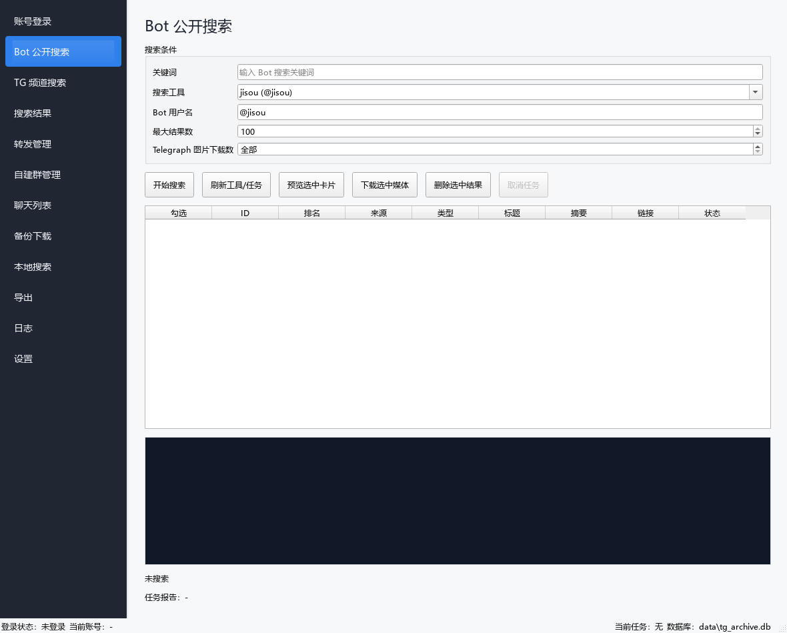
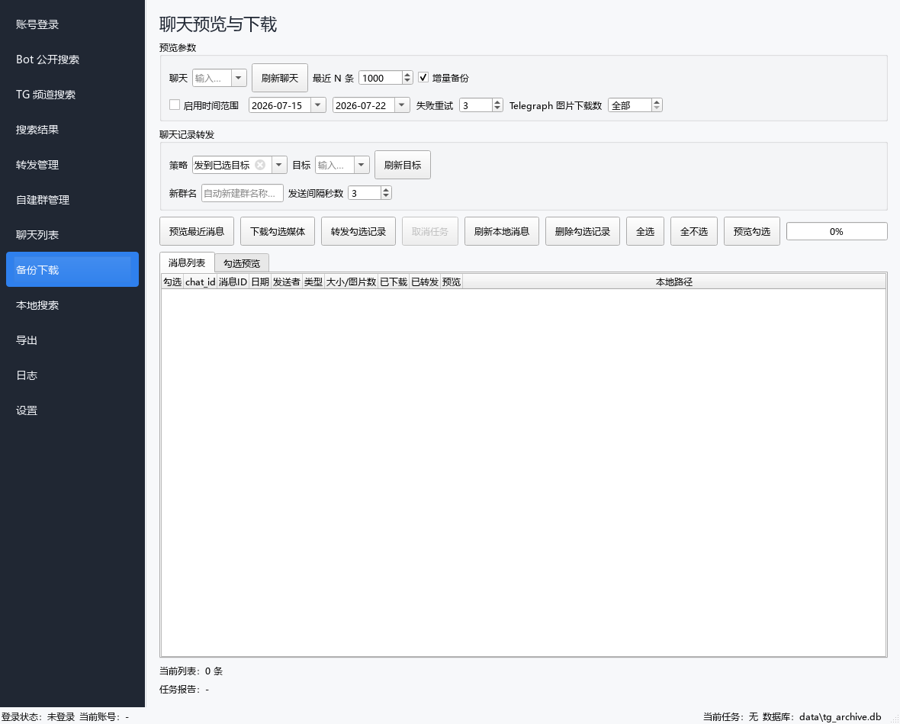
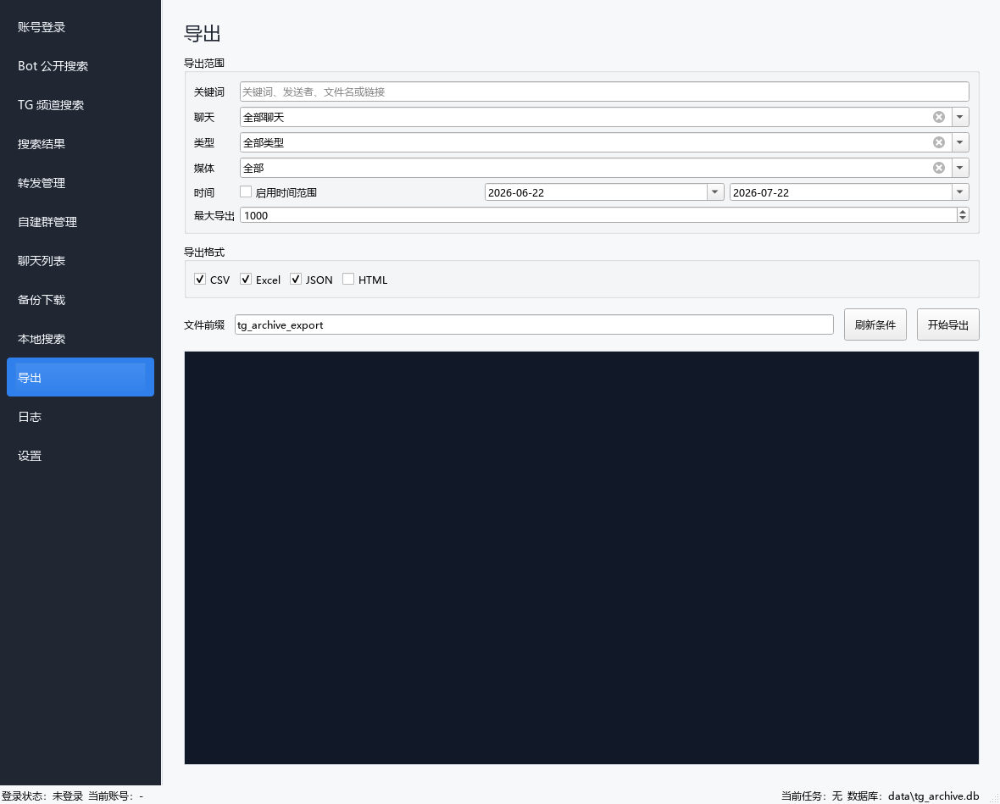

# TGArchiveManager

[](https://github.com/q909717714/TGArchiveManager/actions/workflows/ci.yml)
[](https://github.com/q909717714/TGArchiveManager/releases/latest)
[](LICENSE)
[](https://www.python.org/)

[English](README.en.md) | [简体中文](README.md)

TGArchiveManager is a local Windows desktop tool for managing Telegram content archiving workflows.
The project is implemented based on Python 3.10+, PySide6, Telethon, and SQLite.

> Current Status: `v0.1.0` public preview. The project is under active development. It is recommended to test workflows with a test account and a small chat scope first.

The current MVP covers Telegram login, chat synchronization, public search, search result management and forwarding, chat message forwarding, message backup, media downloading, local search, data export, log troubleshooting, and Windows packaging and release.

## Interface Preview

Screenshots are generated from a local demo environment with an empty configuration, empty database, and unauthenticated state. They do not contain real accounts or chat data.

### Bot Public Search



<details>
<summary>View More Interfaces</summary>

### Backup Download



### Data Export



</details>

## Feature Scope

Supported workflows:

- Log in to Telegram using API ID/API Hash, phone verification code, and optional two-step verification (2FA) password.
- Synchronize chats accessible by the current account, read official Telegram chat folders/groups, and edit local tags.
- Execute Bot public searches via multiple Telegram Bot Providers, or perform TG native message searches within specified joined channels/groups on a dedicated TG Channel Search page, and save standardized results. TG channel search results can display media file sizes or Telegraph image counts.
- When `telegra.ph` links appear in Bot/TG search results, Telegram message text, Bot buttons, or link previews, identify them as Telegraph image page cards, parse titles, publish times, author/source, image counts, and Telegram redirection links. Create directories based on page titles during download, with support for limiting downloaded image counts.
- Filter, preview, download, or delete saved search results on the unified Search Results page, or delete search tasks along with their results.
- Forward saved search results as text cards to existing groups or newly created organization groups.
- Forward locally backed-up chat history as plain text records to existing target groups or automatically created new groups. Image/video records include internal download links recognized by the application.
- Back up chat messages to SQLite based on recent N messages or a specified time range.
- Download media from accessible messages for the current account, display progress (current item, downloaded MBs, and image counts), and track failure, retry, and skipped states.
- Perform keyword, chat, time, and type filtering on locally backed-up messages.
- Export to CSV, Excel, and JSON, with HTML available as an optional enhancement.
- Troubleshoot issues on the Log page by log file, module, level, task ID, and keyword filters.
- Edit Telegram, search, forwarding, backup download, export, and logging configurations on the Settings page, and save them to local `config/config.yaml`.
- Long-running tasks for Bot public search, TG channel search, search result media download, forwarding management, and backup download support cancellation requests from the interface. Cancellation stops at safe checkpoints without forcibly terminating threads.
- Local records can be deleted from chat lists, self-created group registrations, search results, backed-up messages, and local search results. Deleting records does not remove Telegram remote content or media files already downloaded to disk.
- Primary dropdown menus support fuzzy keyword filtering to quickly locate options in large chat lists, target groups, or task selections.

Unsupported features (out of scope):

- Automatic mass group joining.
- Automatic user inviting or member scraping.
- Cracking or accessing private content without account permissions.

## Quick Start

```powershell
python -m venv .venv
.\.venv\Scripts\python.exe -m pip install -r requirements.txt
.\.venv\Scripts\python.exe main.py
```

Run initialization check only without launching the GUI:

```powershell
.\.venv\Scripts\python.exe main.py --check
```

Run unit tests:

```powershell
.\.venv\Scripts\python.exe -m unittest discover -s tests
```

## Configuration

The program prioritizes reading `config/config.yaml`. If this file does not exist, `config/config.yaml.example` is used.

Telegram API credentials saved on the login page are written to `config/config.yaml`. This file should only be kept locally and must not be committed or distributed.

For complete configuration details, see: [configuration.md](docs/configuration.md).

## Privacy and Security

- Real configuration files, Telegram sessions, SQLite databases, logs, downloads, exports, and local build artifacts are excluded from version control.
- Remove phone numbers, chat contents, API Hash, verification codes, and passwords before posting Issues, PRs, test logs, or screenshots.
- The application only processes content that the current account has permission to access. It does not provide mass group joining, member scraping, or unauthorized access capabilities.
- Report security issues privately according to [SECURITY.md](SECURITY.md).

## Usage

For complete usage instructions, see: [user-guide.md](docs/user-guide.md).

Main workflows include:

- Telegram Login
- Chat List Synchronization
- Bot Public Search
- TG Channel Search
- Search Result Management
- Search Result Card Forwarding
- Chat Record Forwarding
- Backup and Media Download
- Local Search and Export
- Log Troubleshooting
- Settings

## Windows Packaging

Recommended command for repeated packaging:

```powershell
.\package.cmd
```

PowerShell equivalent entry point:

```powershell
powershell -ExecutionPolicy Bypass -File .\package.ps1
```

Run when packaging dependencies need to be installed for the first time:

```powershell
powershell -ExecutionPolicy Bypass -File .\package.ps1 -InstallDeps
```

Specify Python interpreter:

```powershell
powershell -ExecutionPolicy Bypass -File .\package.ps1 -Python .\.venv\Scripts\python.exe
```

The underlying build script can still be called directly:

```powershell
powershell -ExecutionPolicy Bypass -File scripts\build_windows.ps1
```

Build artifacts output to:

```text
dist\TGArchiveManager
```

The build script will create or verify runtime writable directories at the same level as the executable:

- `config`
- `sessions`
- `logs`
- `logs\tasks`
- `downloads`
- `exports`
- `data`

For release acceptance steps in a clean Windows environment, see: [release-checklist.md](docs/release-checklist.md).

## Troubleshooting and Logs

Application logs are located in `logs`, and task-specific logs are located in `logs/tasks`.

The in-app Log page supports:

- Filter by log file
- Filter by module
- Filter by level
- Filter by task ID
- Filter by keyword or error code
- Open log directory
- Export current filtered logs
- Copy latest error details

## Development Checks

```powershell
python -m compileall . -q
python -m unittest discover -s tests
python main.py --check
$env:QT_QPA_PLATFORM="offscreen"; python main.py --check-gui
python scripts\preflight_check.py --root .
```

The public repository runs the above core checks repeatedly via GitHub Actions in a Windows / Python 3.10 environment. For complete usage procedures, see the [User Guide](docs/user-guide.md). For version changes, see [CHANGELOG.md](CHANGELOG.md).

## Contributing and License

Feedback on installation compatibility, export formats, and security issues via [Issues](https://github.com/q909717714/TGArchiveManager/issues) is welcome. Contributions starting from `good first issue` or `help wanted` tasks are also appreciated. Please read [CONTRIBUTING.md](CONTRIBUTING.md) before submitting an Issue or PR. The project is licensed under the [MIT License](LICENSE).
