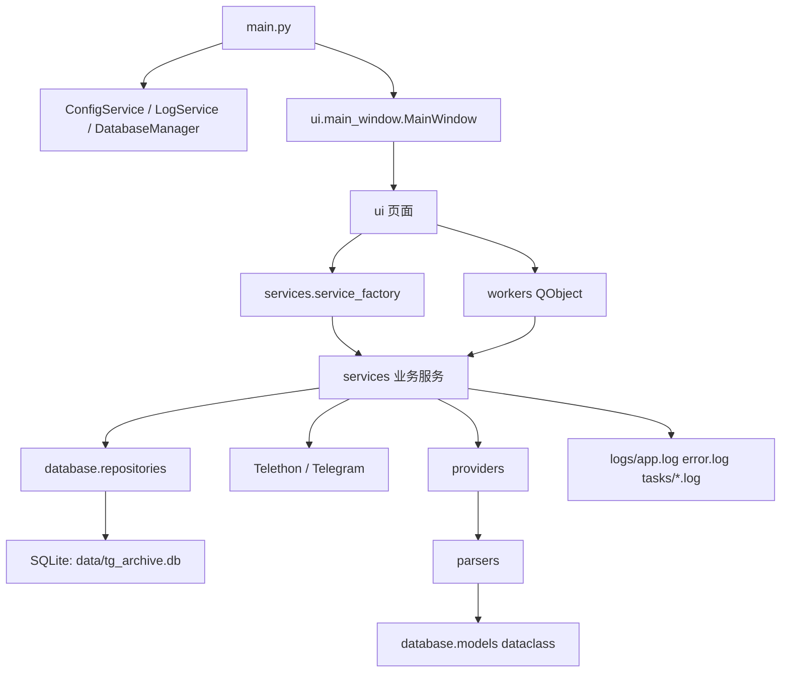

# TGArchiveManager 概览与总体架构

本文件拆分自 `docs/project-outline.md`，保留原大纲章节编号，供后续按主题定位。

## 1. 项目定位和技术栈

TGArchiveManager 是本地 Windows 桌面应用，用于 Telegram 归档、公开搜索、结果转发、消息备份、媒体下载、本地搜索、导出和日志诊断。当前源码是 Python 项目，不是 Qt C++ 项目，没有 `.cpp/.h` 文件。用户原问题中的 “Cpp|h 文件实现功能” 在本仓库对应为 `.py` 模块职责。

主要依赖：

- Python 3.10+。
- PySide6：桌面 UI、`QMainWindow`、`QWidget` 页面、`QThread`、Signal/Slot。
- Telethon：Telegram 登录、Bot 消息、聊天列表、建群、发消息、读取消息、下载媒体。
- sqlite3：本地数据库。`requirements.txt` 中有 SQLAlchemy，但当前源码未使用 SQLAlchemy ORM。
- PyYAML：配置读取/保存。
- openpyxl、pandas、Jinja2：导出和后续扩展依赖；当前 Excel 导出直接使用 openpyxl。
- PyInstaller：Windows 打包。

## 2. 总体架构

分层规则：

- `ui/` 可以依赖 Service、Repository、Worker，用于装配和展示；不要把复杂业务规则写在 UI 回调中。
- `services.service_factory` 集中构造页面常用的 Telegram、公开搜索、下载、转发、备份和建群服务，避免页面重复拼装 Repository、Logger 和配置。
- `workers/` 只负责后台调用和信号转发；不要直接操作 UI 控件。
- `services/` 编排业务、错误转换、任务日志、Telegram 调用和导出。
- `database/` 不依赖 UI，不依赖 Telethon，只管理本地数据。
- `providers/` 不直接入库，只返回 `SearchResult` 列表或抛出 Provider 异常。
- `parsers/` 纯解析和归一化，适合单元测试覆盖。

