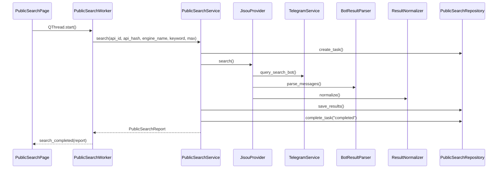
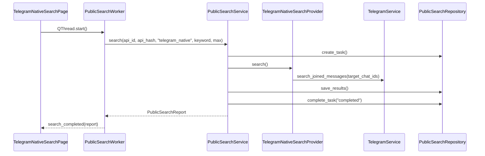

# 公开搜索链路

本文件拆分自 `docs/project-outline.md`，保留原大纲章节编号，供后续按主题定位。

## 8. 公开搜索链路

入口页面：

- Bot 公开搜索：`ui/public_search_page.py`。
- TG 频道搜索：`ui/telegram_native_search_page.py`。
- 统一搜索结果管理：`ui/search_result_page.py`。

Bot Provider 调用链：

TG 原生搜索调用链：

文件职责：

- `providers/base_provider.py`：定义 `BaseSearchProvider`、`SearchProviderError`、`SearchProviderVerificationRequired`。验证异常可通过 `attach_task_context()` 带回任务上下文；Provider 方法可选接收 `cancel_token`。
- `providers/jisou_provider.py`：调用 Telegram Bot，支持配置或 UI 指定 engine_name、bot_username 和分页点击间隔；自动点击下一页按钮直到达到结果数量或无法继续，分页等待和下一页点击支持协作取消；检测人机验证；解析并归一化结果。
- `providers/telegram_native_provider.py`：不使用 Bot，调用 `TelegramService.search_joined_messages()` 搜索已加入频道/群聊消息；可接收 UI 多选的 `target_chat_ids` 只搜索指定频道/群聊，把原消息 chat/message id、source link 和媒体大小摘要转为 `SearchResult`；消息文本或链接预览中的 `telegra.ph` 会转为 `telegraph_page`；原生搜索循环支持协作取消。
- `parsers/bot_result_parser.py`：从 Bot 文本、按钮 URL、text entity 中提取 `ParsedBotResult`；无 URL 时可按排名符号解析文本卡片。
- `parsers/telegram_link_parser.py`：提取 URL，归一化 t.me 链接，识别 `invite`、`message`、`bot`、`channel`、`telegraph_page`、普通 `link`。
- `parsers/result_normalizer.py`：按 `normalized_url` 或文本哈希去重，生成 `SearchResult`，设置 `rank_no`、`result_type`、`tg_username`、`forward_status`。
- `services/public_search_service.py`：创建任务、按 engine_name 调用 Provider、保存结果、按 `public_search.duplicate_check` 控制是否标记历史重复、处理 `verification_required`、`cancelled` 和失败状态；保存前会调用 `TelegraphService` 补全 `telegraph_page` 元数据并写入 Telegraph 明细表。
- `ui/public_search_page.py`：从 `search_engines` 配置、已同步聊天中 username 以 `bot` 结尾的 Bot 和自定义 Bot 构造 Bot 搜索工具选项；搜索页可预览选中结果卡片、下载选中结果媒体、删除选中搜索结果。
- `ui/telegram_native_search_page.py`：读取本地已同步 `channel/group` 聊天作为搜索范围，按 Telegram 官方分组构建 `QTreeWidget` 可折叠树；分组父节点可一键全选/取消组内频道，子节点勾选会回写半选/全选状态；将选中的 `tg_chat_id` 传给 `TelegramNativeSearchProvider`，搜索结果表格和卡片预览显示媒体大小或 Telegraph 图片数量，搜索结果可下载媒体或删除本地记录。
- `ui/search_result_page.py`：统一读取 `PublicSearchRepository` 中已保存的搜索任务和结果，支持按任务、关键词、类型和时间筛选；可预览选中卡片、通过 `SearchResultDownloadWorker` 下载媒体、删除选中结果或删除当前搜索任务。

搜索结果媒体下载：

1. `SearchResultPage`、`PublicSearchPage` 或 `TelegramNativeSearchPage` 根据勾选的 `public_search_results` id 读取 `SearchResult`。
2. `SearchResultDownloadWorker` 在后台调用 `DownloadService.download_search_results_media()`。
3. `DownloadService` 先按 `SearchResult.result_type` 分流；`telegraph_page` 读取 Telegraph 明细表并下载页面图片，其他结果使用 `SearchResult.tg_chat_id` 和 `tg_message_id` 调 `TelegramService.download_archived_message_media()`。
4. Telegraph 图片下载结果写入 `telegraph_page_images` 和 `download_records`；Telegram 原生媒体下载结果写入 `files` 和 `download_records`；无媒体或缺少原消息定位信息的结果按 skipped 记录。
5. `SearchResultDownloadWorker` 发出的进度包含当前第几个任务、累计已下载 MB、当前文件字节进度，以及普通图片或 Telegraph 图片的已下载张数。

搜索结果删除：

1. `SearchResultPage`、`PublicSearchPage`、`TelegramNativeSearchPage` 或 `ForwardPage` 调用 `PublicSearchRepository.delete_results_by_ids()` 删除勾选的本地搜索结果。
2. 删除结果时同步删除对应 `telegraph_pages`、`telegraph_page_images`、`telegraph_page_links` 和以该结果为来源的 `forward_records`；不会删除下载目录中的媒体文件。
3. `SearchResultPage` 可调用 `PublicSearchRepository.delete_tasks_by_ids()` 删除当前搜索任务，删除任务前会先清理该任务下的搜索结果和关联 Telegraph/转发元数据。

人机验证恢复：

1. `JisouProvider` 检测文本中有人机验证关键词，抛 `SearchProviderVerificationRequired`。
2. `PublicSearchService.search()` 将任务标记为 `verification_required`，把 task_id、keyword、engine、max_results、log_file 附加到异常。
3. `PublicSearchWorker` 将异常转为 dict 发给 UI。
4. `PublicSearchPage` 展示 prompt、按钮选项和验证媒体。
5. 用户选择按钮后，`VerificationClickWorker` 调 `PublicSearchService.submit_verification()`。
6. Provider 点击 Bot 按钮，收集后续结果，成功后复用原 task_id 完成入库。

