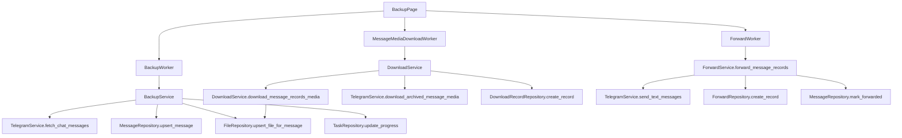

# 备份、下载、本地搜索和导出

本文件拆分自 `docs/project-outline.md`，保留原大纲章节编号，供后续按主题定位。

## 11. 备份、下载、本地搜索和导出

### 11.1 备份下载

入口：`ui/backup_page.py`。

调用链：

`BackupPage` 关键行为：

- “预览最近消息”按聊天、最近 N 条、日期范围和增量参数启动 `BackupWorker`，只读取并保存消息元数据，不直接下载媒体；页面提供 Telegraph 图片下载数量上限，供后续勾选下载 Telegraph 页面图片时使用。
- 消息列表默认不勾选，类型列把本地消息显示为文字、链接、图片、视频、文件、音频、Telegraph 图片页面卡片等；“大小/图片数”列对图片、视频、文件、音频和普通媒体显示 `file_size`，缺失时显示“未知”，Telegraph 页面从本地 `telegraph_pages.image_count` 显示图片数量，未解析时显示“图片数未知”。
- “预览勾选”只汇总当前表格中已勾选行的内容。
- “下载勾选媒体”根据勾选行重新读取本地 `MessageRecord`，通过 `MessageMediaDownloadWorker` 启动独立下载任务。
- “转发勾选记录”要求先预览当前勾选内容，再通过 `ForwardWorker` 把本地 `MessageRecord` 转为纯文本发送到已有目标群，或自动新建一个目标群后发送。
- “取消任务”会请求当前预览、下载或转发 Worker 协作取消；取消不会强制终止线程，已完成并入库的条目保留。
- “删除勾选记录”删除本地 `messages` 记录及直接关联的 `files`、`download_records`、`forward_records` 和 Telegraph 页面明细；不会删除 Telegram 远端消息，也不会删除已下载到磁盘的媒体文件。
- 聊天记录转发不会强制调用 Telegram 原生转发原消息；发送文本包含来源 chat_id/message_id 和媒体元数据，图片/视频额外包含内部下载入口，成功后把 `messages.is_forwarded` 标记为 true。

`BackupService.backup_chat()` 关键行为：

- 如果启用增量，并且 `chats.last_backup_message_id` 存在，`BackupService` 会先检查 `MessageRepository.count_messages(tg_chat_id)`；当本地缓存数量已达到本次请求的最近 N 条时，才把 `last_backup_message_id` 作为 `min_message_id`，否则忽略游标并回补最近 N 条，避免本地缓存不完整时只显示少量新消息。
- 先通过 Telegram 拉取消息元数据，再创建通用任务。
- 每条消息 upsert 到 `messages`，同时保存网页预览、text entity 和按钮中的外部 URL 到 `external_urls`。
- 有媒体时创建或更新 `files`。
- 预览流程默认 `download_media=False`，不下载媒体；保留 `download_media=True` 服务能力用于兼容服务层调用。
- 任务结束后更新 `chats.last_backup_message_id`。
- 任务运行中取消时，已创建的通用任务状态更新为 `cancelled`，已保存消息保留，未处理消息不计失败。

`DownloadService.download_message_records_media()` 关键行为：

- 面向本地已备份且已勾选的 `MessageRecord` 列表，创建独立 download task id 并逐条处理。
- 纯文本或无媒体消息默认 skipped，错误码 `DL002`，只写 `download_records`，不创建文件元数据。
- 如果本地消息正文、预览、原文链接或 `external_urls` 中包含 `telegra.ph`，则按 Telegraph 图片页面解析 HTML、保存页面元数据和图片/Telegram 跳转链接，并按页面标题创建目录下载图片；图片数量受 `BackupPage` 传入的 Telegraph 图片下载数限制。
- 如果纯文本消息包含 `tgarchive://download?chat_id=...&message_id=...`，则解析内部下载链接，按链接指向的原始 `chat_id/message_id` 调用现有 Telegram 媒体下载能力。
- 有媒体消息会确保存在对应 `FileRecord`，再委托 `download_message_media()` 下载。
- 通过 `MessageMediaDownloadWorker` 发出进度；进度包含当前第几个任务、累计已下载 MB、当前文件字节进度，以及普通图片或 Telegraph 图片的已下载张数；成功时更新 `files`、`messages.is_downloaded` 和 `download_records`。
- 取消时在下一次条目循环、Telethon 进度回调或 Telegraph HTTP 分块读取检查点退出；未处理条目不会写失败下载记录。

`DownloadService.download_message_media()` 关键行为：

- 无媒体 skipped，错误码 `DL002`。
- 下载前按 `download.download_images/videos/documents/audio`、`download.max_file_size_mb` 和 `download.skip_existing` 判断是否跳过；跳过会写入 `download_records`。
- 下载目录为 `download.root_dir/<tg_chat_id>`。
- 按 `retry_count` 重试；遇到 success 或 skipped 停止。
- `_persist_result()` 更新 `files`、必要时 `messages.is_downloaded`，并写 `download_records`。

`DownloadService.download_search_results_media()` 关键行为：

- 面向 `public_search_results` 中带 `tg_chat_id` 和 `tg_message_id` 的搜索结果，主要服务 TG 原生搜索结果。
- `result_type=telegraph_page` 时不调用 Telegram 原生媒体下载，而是读取 `telegraph_page_images`，按 Telegraph 页面标题创建目录，并按 UI 传入的图片数量上限下载正文图片。
- 缺少原消息定位信息的结果 skipped，错误码 `DL002`。
- 普通搜索结果媒体同样遵守下载类型、大小上限和跳过已存在文件配置；Telegraph 图片下载遵守图片开关和大小上限。
- 下载目录同样为 `download.root_dir/<tg_chat_id>`。
- 通过 `SearchResultDownloadWorker` 发出进度，结果写入 `files` 和 `download_records`；不会把未备份消息强制写入 `messages`。
- 搜索结果媒体下载同样支持协作取消；已完成的下载记录保留，未处理结果不写失败记录。

### 11.2 本地搜索

入口：`ui/local_search_page.py`。

- `LocalSearchPage._query_from_ui()` 构造 `LocalSearchQuery`。
- `LocalSearchService.search()` 调 `MessageRepository.search_messages()`。
- `MessageRepository.search_messages()` 支持关键词、聊天、日期、消息类型、媒体过滤、limit。
- 页面可把当前结果直接传给 `ExportService.export_message_records()`，也可删除勾选的本地消息记录；删除语义与 `BackupPage` 相同，只清 SQLite 记录和直接关联元数据。

### 11.3 导出

入口：`ui/export_page.py` 或 `LocalSearchPage` 的导出按钮。

`ExportService` 支持：

- CSV：UTF-8 with BOM，适合 Excel 打开。
- Excel：openpyxl，自动列宽上限 60。
- JSON：UTF-8，`ensure_ascii=False`。
- HTML：简单表格，配置默认关闭，可在 UI 勾选。

导出列定义在 `ExportService.COLUMNS`，新增消息字段导出时应同步扩展 `_message_to_row()`、测试和文档。

